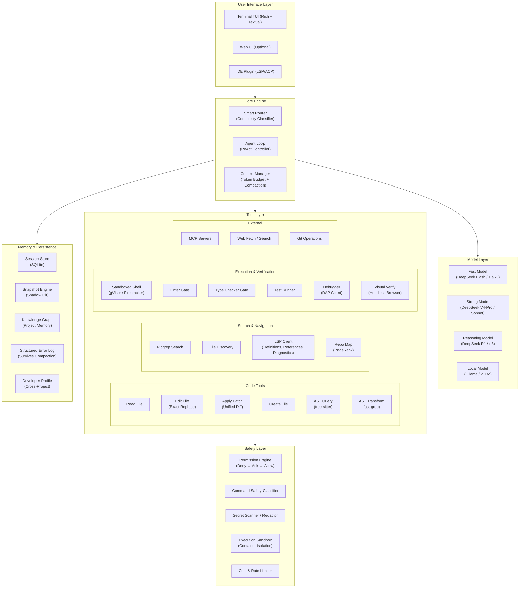

# Building a Next-Generation AI Coding Agent: Deep Architecture Study

> **Goal**: Understand exactly how Claude Code, OpenCode, and Aider work under the hood — every subsystem, every tradeoff, every failure mode — then design something better.

---

## Part 1: The Three Architectures Dissected

### How They Compare At a Glance

| Dimension | Claude Code | OpenCode | Aider |
| :--- | :--- | :--- | :--- |
| **Language** | TypeScript (Bun) | TypeScript (Bun) | Python |
| **Terminal UI** | React + Ink + Yoga (flexbox) | Client-Server (HTTP/SSE + TUI) | Rich + prompt_toolkit |
| **LLM SDK** | Anthropic Messages API (native) | Vercel AI SDK (multi-provider) | LiteLLM (multi-provider) |
| **Edit Strategy** | Exact string replacement | Exact string replacement + unified patch | Search/Replace blocks + whole file + unified diff + architect mode |
| **Codebase Awareness** | Dynamic filesystem exploration (grep/glob) | Dynamic exploration + LSP | Tree-sitter AST + PageRank repo map |
| **Context Recovery** | LLM-powered compaction (~95% threshold) | LLM-powered compaction | Chat history summarization (background thread) |
| **Undo System** | Isolated shadow Git repo (snapshots) | Isolated shadow Git repo (snapshots) | Native Git commits (`git reset --hard HEAD~1`) |
| **Permission Model** | Deny → Ask → Allow (declarative rules + hooks) | Deny → Ask → Allow (plugin hooks) | Interactive prompts per operation |
| **Sub-Agents** | `dispatch_agent` (isolated child context) | `task` tool (child sessions with `parentID`) | ArchitectCoder delegates to EditorCoder |
| **Memory** | `CLAUDE.md` (manual) + `MEMORY.md` (auto) + `autoDream` pruning | `AGENTS.md` + session DB | `.aider.conf.yml` + Git history |
| **Plugin System** | Lifecycle hooks (`PreToolUse`, `PostToolUse`) | Full plugin API (`@opencode-ai/plugin`) with 15+ hook points | None (monolithic) |
| **MCP Support** | Native (stdio + HTTP/SSE) | Native (stdio + SSE) | None |
| **Cost Optimization** | Prompt caching (ephemeral markers) + Haiku for utilities | Prompt caching + small model routing | Prompt caching + weak model for commits/summaries |
| **IDE Integration** | VS Code extension | ACP protocol (Zed native) | None (terminal only) |

---

## Part 2: The 8 Core Subsystems (Deep Dive)

### Subsystem 1: The Agent Loop

All three tools implement the same fundamental pattern — a **ReAct (Reason + Act) loop** — but with critical differences in execution:

```
┌─────────────────────────────────────────────────────────┐
│                    THE AGENT LOOP                       │
│                                                         │
│  User Prompt                                            │
│       │                                                 │
│       ▼                                                 │
│  ┌─────────────────┐                                    │
│  │ Context Assembly │ ◄── System prompt + tools +       │
│  │                   │     repo map + files + history    │
│  └────────┬──────────┘                                  │
│           ▼                                             │
│  ┌─────────────────┐                                    │
│  │   LLM API Call   │ ◄── Streaming response            │
│  └────────┬──────────┘                                  │
│           ▼                                             │
│  ┌─────────────────┐                                    │
│  │ Response Parser  │                                   │
│  └───┬─────────┬────┘                                   │
│      │         │                                        │
│   Text      Tool Call                                   │
│   Output       │                                        │
│      │    ┌────▼─────────┐                              │
│      │    │  Permission   │                              │
│      │    │  Check        │                              │
│      │    └────┬─────────┘                              │
│      │         │                                        │
│      │    ┌────▼─────────┐                              │
│      │    │  Execute Tool │ ── read/write/bash/search    │
│      │    └────┬─────────┘                              │
│      │         │                                        │
│      │    ┌────▼─────────┐                              │
│      │    │ Feed Result   │ ── stdout/stderr/content     │
│      │    │ Back to LLM   │                              │
│      │    └────┬─────────┘                              │
│      │         │                                        │
│      │         └──────────► Loop continues               │
│      │                                                  │
│      └──► Display to user                               │
└─────────────────────────────────────────────────────────┘
```

> [!IMPORTANT]
> **Key Insight**: The loop itself is simple. The complexity is in everything *around* it: how context is assembled, how edits are applied, how errors trigger self-correction, and how the system prevents runaway execution.

#### Claude Code's Loop
- Single-threaded, state-governed loop in TypeScript.
- Uses Anthropic's native `tool_use` / `tool_result` message blocks.
- Multi-tier model routing: **Sonnet** (with extended thinking) for reasoning, **Haiku** for safety classification, title generation, and memory compaction.
- Loop termination: when the model produces a response with no tool calls, or hits a max-steps ceiling.

#### OpenCode's Loop
- Built on **Effect-TS** (algebraic effects for DI, concurrency, retries) + **Vercel AI SDK** for streaming.
- Client-server architecture: the loop runs in a headless daemon; TUI connects via HTTP/SSE.
- Emits fine-grained `Part` objects (`TextPart`, `ToolPart`, `ReasoningPart`, `StepStartPart`, `StepFinishPart`).
- Includes doom-loop detection (detects repeated failed tool calls).

#### Aider's Loop
- Python class hierarchy (`Coder` → `EditBlockCoder` / `WholeFileCoder` / `ArchitectCoder`).
- Dual-loop: outer interactive loop + inner **reflection loop** (max 3 retries for lint/test failures).
- Uses LiteLLM as universal LLM abstraction.
- Git-centric: every successful turn = one atomic Git commit.

---

### Subsystem 2: The Tool System

The tools are the agent's **hands**. The quality, precision, and safety of these tools directly determines how useful (and dangerous) the agent is.

#### Core Tool Comparison

| Tool | Claude Code | OpenCode | Aider |
| :--- | :--- | :--- | :--- |
| **Read File** | `View` (line ranges, 2000-line default window) | `read` (line slices, offsets) | Loads full file into `chat_files` context |
| **Write File** | `Write` (full overwrite) | `write` (atomic write) | `WholeFileCoder` (full file in code fence) |
| **Edit File** | `Edit` (exact `old_string` → `new_string`) | `edit` (exact string replacement) | `EditBlockCoder` (`SEARCH/REPLACE` blocks with fuzzy matching) |
| **Patch** | ❌ | `patch` / `apply_patch` (unified diff) | `UnifiedDiffCoder` (forgiving parser) |
| **Shell** | `Bash` (persistent shell, PTY) | `shell` (PTY, timeout, env injection) | `run_cmd` (subprocess) |
| **Search** | `GrepTool` (ripgrep wrapper) | `grep` (ripgrep) | Via shell (`rg` command) |
| **File Discovery** | `GlobTool` | `glob` | Via shell (`find` command) |
| **Directory Listing** | `LS` | Via `glob` / `read` | Via shell (`ls` command) |
| **Parallel Execution** | `BatchTool` | `batch` (experimental) | ❌ |
| **Sub-Agent** | `dispatch_agent` | `task` (child session) | ArchitectCoder → EditorCoder |
| **LSP** | ❌ | `lsp` (definitions, references, diagnostics) | ❌ |
| **Web Fetch** | `WebFetchTool` / `WebSearchTool` | `fetch` | ❌ |
| **Notebook** | `ReadNotebook` / `NotebookEditCell` | ❌ | ❌ |
| **Interactive Question** | ❌ | `question` (multi-choice UI in TUI) | ❌ |

> [!TIP]
> **Where they all fall short**: None of them have native **debugger integration** (DAP), **AST-level manipulation** (ast-grep), or **git blame/bisect** tools. These are massive opportunities for a next-gen agent.

---

### Subsystem 3: The Edit Strategy (The Hardest Problem)

This is where most agents succeed or fail. Getting the LLM to surgically modify code without destroying the rest of the file is the **single hardest unsolved UX problem** in AI coding.

#### The Three Approaches and Why Each Breaks

**Approach A: Whole File Replacement**
```
The model outputs the entire file inside a code fence.
```
- ✅ Simple. No matching logic needed. Impossible to have "block not found" errors.
- ❌ **Catastrophically expensive** in tokens (rewriting a 500-line file costs 500 output tokens even to change 1 line).
- ❌ **"Lazy coding" truncation**: Models frequently write `// ... rest of code unchanged ...` or `# existing code here`, literally deleting functional code.
- ❌ Hits output token caps on files > 200 lines.

**Approach B: Exact String Search/Replace** (Claude Code & OpenCode)
```
old_string: "def calculate(x):\n    return x * 2"
new_string: "def calculate(x, y):\n    return x * y"
```
- ✅ Token-efficient. Only sends the changed lines.
- ✅ Precise and deterministic (if the match is found).
- ❌ **Whitespace fragility**: A single tab-vs-space difference or trailing whitespace causes complete failure.
- ❌ **Uniqueness constraint**: If `old_string` appears multiple times, edit fails.
- ❌ Requires the model to have **already read the file** with exact current content.

**Approach C: Search/Replace Blocks with Fuzzy Matching** (Aider)
```
path/to/file.py
<<<<<<< SEARCH
def calculate(x):
    return x * 2
=======
def calculate(x, y):
    return x * y
>>>>>>> REPLACE
```
- ✅ Model-friendly syntax (inspired by Git merge conflict markers — models trained on this extensively).
- ✅ **Fuzzy matching fallback**: If exact match fails, Aider uses `difflib` similarity scoring to find the closest block.
- ✅ Multiple files in one response.
- ❌ Fuzzy matching can match the **wrong** block in files with repetitive patterns.
- ❌ Model still hallucinates block contents.

**Approach D: Architect Mode** (Aider's Innovation)
```
Phase 1: Architect Model (o1/R1/Claude Thinking) → Describes changes in natural language
Phase 2: Editor Model (Sonnet/GPT-4o) → Translates description into SEARCH/REPLACE blocks
```
- ✅ **State-of-the-art accuracy** on SWE-Bench. Separates reasoning from formatting.
- ✅ Reasoning models (o1, R1) are terrible at diff syntax but excellent at understanding what needs to change.
- ❌ 2x API cost. 2x latency.
- ❌ Information loss between architect and editor.

> [!IMPORTANT]
> **The Winning Strategy for Our Agent**: Use **Architect Mode as default** with DeepSeek R1/V4-Pro as Architect and DeepSeek Flash as Editor. Fall back to direct Search/Replace for simple single-file edits. Never use whole-file replacement.

---

### Subsystem 4: Codebase Awareness (How the Agent "Sees" Your Project)

This is where the three tools diverge most dramatically.

#### Claude Code: Dynamic Filesystem Exploration
- **No pre-built index.** No repo map. No embeddings.
- The model explores the codebase in real-time using `GlobTool` → `GrepTool` → `View`, exactly like a human developer would.
- **Advantage**: Zero stale-index problems. Works on any codebase instantly.
- **Disadvantage**: Burns tokens and API calls on exploration. Can miss distant dependencies it never discovers.

#### Aider: Tree-Sitter AST + PageRank Repo Map
- Pre-parses every file using **tree-sitter** to extract function/class/method definitions and their references.
- Builds a **directed graph** (NetworkX) where edges go from referencing files to defining files.
- Runs **Personalized PageRank** (biased toward currently active files) to rank which structural signatures matter most.
- Uses **binary search** to pack maximum structural context into a strict token budget (default: 1024 tokens).
- **Advantage**: Global architectural awareness in minimal tokens. The model knows what functions exist and where, even in files it hasn't read.
- **Disadvantage**: Static index that must be refreshed. Reverse dependencies (callers of a base class) are under-ranked.

#### OpenCode: Dynamic Exploration + LSP
- Similar dynamic exploration to Claude Code.
- **Unique advantage**: First-class **LSP integration** (`lsp` tool) — can query language servers for exact symbol definitions, references, hover docs, and workspace diagnostics.
- **Advantage**: Compiler-grade accuracy for symbol resolution. No grep guessing.
- **Disadvantage**: Requires running language servers. Not all languages have good LSP support.

> [!TIP]
> **The Best of All Worlds for Our Agent**: Combine Aider's **PageRank repo map** (for global awareness) with OpenCode's **LSP integration** (for precise symbol resolution) and Claude Code's **dynamic exploration** (for on-demand deep dives). This triple-layer approach has never been implemented.

---

### Subsystem 5: Context Management (The Token Budget War)

Every agent fights the same battle: fitting a useful amount of information into a finite context window.

#### The Token Budget Breakdown (Typical ~200K Context)

```
┌─────────────────────────────────────────────────────┐
│                  CONTEXT WINDOW (~200K)              │
│                                                      │
│  ┌──────────────────────────────────────────────┐    │
│  │ System Prompt + Tool Schemas    (~5K-10K)    │    │
│  ├──────────────────────────────────────────────┤    │
│  │ Project Rules / CLAUDE.md       (~2K-5K)     │    │
│  ├──────────────────────────────────────────────┤    │
│  │ Repo Map / Structure            (~1K-4K)     │    │
│  ├──────────────────────────────────────────────┤    │
│  │ Active File Contents            (~10K-50K)   │    │
│  ├──────────────────────────────────────────────┤    │
│  │ Conversation History            (~20K-100K)  │    │
│  ├──────────────────────────────────────────────┤    │
│  │ Tool Results (stdout/stderr)    (~10K-50K)   │    │
│  ├──────────────────────────────────────────────┤    │
│  │ Current User Request            (~0.5K-2K)   │    │
│  ├──────────────────────────────────────────────┤    │
│  │ Reminder / System Suffix        (~0.5K-1K)   │    │
│  └──────────────────────────────────────────────┘    │
└─────────────────────────────────────────────────────┘
```

#### Compaction Strategies

| Strategy | Used By | How It Works |
| :--- | :--- | :--- |
| **LLM-Powered Compaction** | Claude Code, OpenCode | At ~95% capacity, an LLM pass summarizes history, prunes redundant tool outputs, preserves goals/decisions/errors |
| **Background Summarization** | Aider | Async thread summarizes old turns using a weak/cheap model. Non-blocking. |
| **Prompt Caching** | All three | Mark stable prefixes (system prompt, tool schemas, file contents) with cache control headers. Saves 80-90% on repeated turns. |
| **Manual Compaction** | Claude Code (`/compact`) | User triggers selective summarization with optional focus guidance |

> [!WARNING]
> **Critical Failure Mode**: All compaction strategies lose low-level debugging details. After compaction, the agent may re-attempt fixes it already tried. Our agent should maintain a **structured error log** (not prose summary) that survives compaction.

---

### Subsystem 6: The Permission & Safety System

#### The Threat Model

| Threat | Example | Severity |
| :--- | :--- | :--- |
| **Destructive Commands** | `rm -rf /`, `DROP TABLE users`, `git push --force` | 🔴 Critical |
| **Secret Exfiltration** | Reading `.env` files and `curl`-ing API keys to external servers | 🔴 Critical |
| **Prompt Injection** | Malicious instructions hidden in README files, GitHub issues, or dependency code | 🔴 Critical |
| **Resource Exhaustion** | Fork bombs, infinite loops, runaway cloud charges | 🟡 High |
| **Silent Code Corruption** | Model weakens test assertions to make tests "pass", or deletes edge-case handling | 🟡 High |

#### How Each Tool Handles Safety

| Feature | Claude Code | OpenCode | Aider |
| :--- | :--- | :--- | :--- |
| **Default Mode** | Ask for all mutations | Ask for all mutations | Ask for file creation, auto-commit edits |
| **Safety Classifier** | Haiku-based pre-execution bash analysis | Plugin-configurable `permission.ask` hook | ❌ |
| **Lifecycle Hooks** | `PreToolUse` / `PostToolUse` (external scripts) | 15+ plugin hooks | ❌ |
| **Dangerous Mode** | `--dangerously-skip-permissions` (CI/CD only) | `--auto` flag | `--yes` flag |
| **Sandboxing** | Docker recommended for CI | Docker recommended | Docker recommended |
| **Secret Detection** | ❌ (relies on model judgment) | ❌ | ❌ |

> [!CAUTION]
> **None of them have real sandboxing built-in.** They all run commands directly on your machine. Production-grade agents (like Devin) use **Firecracker microVMs** or **gVisor containers** with network egress isolation. Our agent should sandbox by default.

---

### Subsystem 7: Memory & Persistence

| Layer | Claude Code | OpenCode | Aider |
| :--- | :--- | :--- | :--- |
| **Session Storage** | `~/.claude/sessions/` (serialized) | SQLite DB (`opencode.db`) with Drizzle ORM | In-memory (Git history for undo) |
| **Project Knowledge** | `CLAUDE.md` (manual, checked into repo) | `AGENTS.md` + agent markdown files | `.aider.conf.yml` |
| **Auto-Memory** | `MEMORY.md` (auto-learned habits, max 200 lines) | ❌ | ❌ |
| **Memory Maintenance** | `autoDream` background pruning agent | ❌ | ❌ |
| **Session Resume** | `--continue` / `--resume` / `--resume <id>` | Session list in DB, fork support | `/load` / `/save` (experimental) |

> [!TIP]
> **Claude Code's `autoDream` is brilliant but under-implemented.** Our agent should have a proper **knowledge graph memory** (not a flat markdown file) that learns project patterns, common errors, architectural decisions, and developer preferences over time.

---

### Subsystem 8: Undo / Version Control

| Feature | Claude Code | OpenCode | Aider |
| :--- | :--- | :--- | :--- |
| **Mechanism** | Shadow Git repo (isolated from user's `.git`) | Shadow Git repo (isolated bare repo with worktree pointing to project) | User's actual Git repo |
| **Granularity** | Per-step snapshots (each tool execution) | Per-step snapshots (`StepStartPart` / `StepFinishPart` with commit hashes) | Per-turn (one commit per successful agent turn) |
| **User Impact** | Zero — invisible to `git log` | Zero — invisible to `git log` | Visible — creates real commits in user's history |
| **Undo Command** | Built-in | `/undo` (git checkout from snapshot) | `/undo` (`git reset --hard HEAD~1`) |

> [!NOTE]
> Aider's approach of using real Git commits is elegant but **pollutes the user's Git history** with dozens of AI-generated commits. The shadow Git approach (Claude Code / OpenCode) is strictly superior for professional workflows.

---

## Part 3: Where They ALL Still Fail

These are the unsolved problems — the gaps where a next-generation agent can differentiate:

### 1. No Structural Code Understanding
- All three rely on **text-level** operations (grep, string matching, line numbers).
- None of them truly understand code **structure** — inheritance hierarchies, call graphs, type flows, dependency injection chains.
- **Solution**: AST-first tools using `tree-sitter` and `ast-grep` for structural queries and transformations.

### 2. No Debugger Integration
- When code fails at runtime, all three dump the stack trace into the prompt as text.
- None can set breakpoints, step through execution, or inspect variable state.
- **Solution**: Debug Adapter Protocol (DAP) integration — programmatic breakpoints, stack frame inspection, variable watches.

### 3. No Visual Verification for Frontend
- None can verify that CSS changes look correct, that layouts aren't broken, or that UI components render properly.
- **Solution**: Headless browser screenshots + visual diff comparison (Playwright / Puppeteer).

### 4. Weak Self-Verification
- The model that writes the code also judges whether the code is correct → **confirmation bias**.
- **Solution**: Separate Proposer and Verifier agents with independent context. The Verifier should never see the Proposer's reasoning.

### 5. No Learning Across Projects
- Memory is per-project. The agent doesn't learn that "this developer prefers functional style" or "always use pytest-asyncio for async tests" across repositories.
- **Solution**: Global developer profile memory + project-specific memory, with cross-project pattern extraction.

### 6. Compaction Loses Critical Details
- After context compaction, agents forget specific error messages, stack traces, and previously attempted fixes.
- **Solution**: Structured error log (JSON, not prose) that survives compaction with deduplication.

### 7. No Cost-Aware Routing
- All three use a fixed model for the entire session. No dynamic routing based on task complexity.
- **Solution**: Automatic complexity classification → route simple tasks to cheap/fast models, complex tasks to expensive/powerful models.

---

## Part 4: The Next-Gen Architecture Blueprint

### Design Principles

1. **AST-First, Text-Second**: Use tree-sitter for all code understanding. Fall back to grep only when AST queries aren't available.
2. **Architect + Editor by Default**: Separate reasoning from code formatting. Always.
3. **Verify Everything**: Lint → Type-check → Test → Visual diff. Never trust the model's self-assessment.
4. **Sandbox by Default**: All commands run in isolated containers. Explicit opt-out for trusted operations.
5. **Learn and Remember**: Build a knowledge graph of project patterns, developer preferences, and past mistakes.
6. **Cost-Optimize Ruthlessly**: Route 80% of tasks through cheap models. Reserve expensive models for complex reasoning.

### Proposed System Architecture



### The Verification Pipeline (What Makes It Better)

Every code change flows through a mandatory verification pipeline before being committed:

```
Code Edit Applied
       │
       ▼
┌──────────────┐     ┌──────────────┐     ┌──────────────┐     ┌──────────────┐
│  AST Syntax  │────►│   Linter     │────►│ Type Checker  │────►│ Test Suite   │
│   Check      │     │  (ruff/eslint)│     │ (mypy/tsc)   │     │ (pytest/jest)│
└──────┬───────┘     └──────┬───────┘     └──────┬───────┘     └──────┬───────┘
       │                    │                    │                    │
    PASS/FAIL            PASS/FAIL            PASS/FAIL            PASS/FAIL
       │                    │                    │                    │
       └────────────────────┴────────────────────┴────────────────────┘
                                     │
                              ALL PASSED?
                            /           \
                          YES             NO
                           │               │
                    ┌──────▼──────┐  ┌─────▼──────────────┐
                    │ Auto-Commit  │  │ Feed errors to LLM  │
                    │ (Shadow Git) │  │ (Max 3 retries)     │
                    └─────────────┘  └─────────────────────┘
```

### Smart Model Router (What Makes It Cheaper)

```
User Request
     │
     ▼
┌────────────────────────┐
│  Complexity Classifier  │ (Fast model, ~50 tokens)
│  Score: 1-10            │
└────────┬───────────────┘
         │
    ┌────┴────┬──────────┐
    │         │          │
  1-3       4-7        8-10
 Simple    Medium     Complex
    │         │          │
    ▼         ▼          ▼
 Local/    DeepSeek   DeepSeek R1
 Flash     Flash      (Architect)
           (Direct)      +
                      Flash (Editor)
```

---

## Part 5: Tech Stack Recommendation

| Component | Choice | Why |
| :--- | :--- | :--- |
| **Language** | **Python** | Fastest iteration, richest AI/ML ecosystem, tree-sitter bindings, DAP libraries, subprocess control. Your expertise. |
| **Terminal UI** | **Textual** (by Textualize) | Modern, async, widget-based TUI framework. Far superior to raw Rich for interactive apps. Supports CSS-like styling, scrollable panels, syntax highlighting. |
| **LLM Client** | **`openai` SDK** with custom base URLs | Universal. Works with DeepSeek, OpenAI, Anthropic (via proxy), Ollama, vLLM. No heavy abstraction layer. |
| **AST Parsing** | **`tree-sitter`** (py-tree-sitter + tree-sitter-languages) | 130+ language grammars. Used by Aider, GitHub, Neovim. |
| **Code Search** | **`ripgrep`** (subprocess) | Fastest grep tool. Used by all three competitors. |
| **LSP Client** | **`pygls`** or subprocess protocol | Compiler-grade symbol resolution. |
| **Database** | **SQLite** (via `sqlite3` stdlib) | Zero-dependency, embedded, WAL mode for concurrent reads. |
| **Graph / Memory** | **NetworkX** + optional **Neo4j** | PageRank for repo maps. Knowledge graph for long-term memory. |
| **Sandboxing** | **Docker** (default) with **gVisor** (production) | Container isolation for all shell commands. |
| **Version Control** | **`gitpython`** or `subprocess git` | Shadow Git repo for snapshots and undo. |

---

## Part 6: Development Roadmap

### Phase 1: Core Agent (MVP) — 2-3 weeks
- [ ] Agent loop (ReAct) with DeepSeek Flash/V4-Pro
- [ ] 5 core tools: `read_file`, `edit_file`, `create_file`, `run_command`, `search`
- [ ] Interactive terminal UI (Textual)
- [ ] Permission system (ask before mutations)
- [ ] Session persistence (SQLite)
- [ ] Shadow Git snapshots + `/undo`

### Phase 2: Intelligence Layer — 2-3 weeks
- [ ] Tree-sitter repo map with PageRank ranking
- [ ] Architect + Editor mode (dual-model pipeline)
- [ ] Lint → Type-check → Test verification pipeline
- [ ] Context compaction with structured error log preservation
- [ ] Smart model routing (complexity classifier)

### Phase 3: Advanced Features — 3-4 weeks
- [ ] LSP integration (definitions, references, diagnostics)
- [ ] AST-level code transformations (ast-grep)
- [ ] Sub-agent system (task delegation with isolated contexts)
- [ ] MCP server support
- [ ] Knowledge graph memory (cross-session learning)
- [ ] Docker sandboxing for shell commands

### Phase 4: Differentiation — Ongoing
- [ ] DAP debugger integration
- [ ] Visual verification (headless browser screenshots)
- [ ] Multi-agent architecture (Proposer + Verifier + Tester)
- [ ] Plugin system
- [ ] IDE integration (LSP/ACP)
- [ ] Web UI

---

## Part 7: Open Questions for You

> [!IMPORTANT]
> These decisions will shape the entire project. Think about what matters most to you.

1. **Project Name?** — This needs a memorable identity. Something that signals "next-gen coding agent."

2. **Primary Use Case?** — Is this:
   - (a) A personal tool for your own development workflow?
   - (b) An open-source project to build a community around?
   - (c) A commercial product / SaaS?

3. **Model Priority?** — Should we optimize primarily for:
   - (a) DeepSeek (your current $1.59 balance, ultra-cheap)?
   - (b) Multi-provider (DeepSeek + Groq + Ollama + Anthropic)?
   - (c) Local-first (Ollama with cloud fallback)?

4. **Start with Phase 1 MVP immediately?** — Or do you want to refine the architecture further first?
