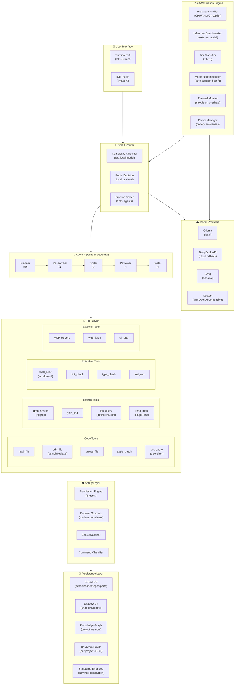

# Implementation Plan: Next-Gen Self-Calibrating AI Coding Agent

> All design decisions finalized via interactive interview. This is the complete, approved blueprint.

---

## Finalized Design Decisions

| Decision | Choice | Rationale |
| :--- | :--- | :--- |
| **Name** | TBD (decide later) | — |
| **Primary Use** | Personal tool (private repo) | Open-source when polished |
| **Language** | TypeScript (Bun runtime) | Same as Claude Code & OpenCode |
| **Project Structure** | Modular monorepo | `core/`, `tools/`, `ui/`, `calibration/`, `providers/`, `agents/`, `memory/` |
| **Terminal UI** | Ink + React | Component-based, flexbox layout, streaming |
| **LLM SDK** | `openai` npm package | Universal OpenAI-compatible client |
| **Model Strategy** | Local-first (Ollama) + cloud fallback (DeepSeek) | Calibration recommends, user overrides |
| **Multi-Agent** | 5-agent sequential pipeline | Planner → Researcher → Coder → Reviewer → Tester |
| **Pipeline Scaling** | Adaptive by complexity | Simple→Coder only, Medium→3 agents, Complex→all 5 |
| **Agent Model Assignment** | Calibration recommends, user decides | Per-project configurable |
| **Edit Strategy** | Architect mode (reasoning + formatting split) | Within the Coder agent |
| **Codebase Awareness** | Triple-layer: PageRank repo map + LSP + dynamic exploration | Best of all three competitors |
| **Context Management** | LLM compaction + structured error log | Error log survives compaction |
| **Calibration** | **Mandatory** on first run (60s benchmark) | Core differentiator |
| **Hardware Profile** | **Per-project** | Different projects may need different configs |
| **Auto-Pull Models** | **Always confirm** first | Never download without asking |
| **Undo System** | Shadow Git (like Antigravity/Claude Code) | Zero pollution of user's Git history |
| **Session Storage** | SQLite with WAL | Fast, structured, supports resume/fork |
| **Memory** | Knowledge graph (project architecture + learned patterns) | Your GRAPH-RAG expertise |
| **Sandbox** | Podman containers (rootless) | Already installed on your machine |
| **MCP Support** | Day one | stdio + HTTP transports |
| **Permission Model** | Multi-level (like Antigravity) | 3-4 tiers from strict to auto |
| **Installation** | npm + binary + curl script | Maximum reach |
| **License** | Private for now | Open-source later |
| **Telemetry** | Opt-in anonymous hardware tier reporting | Improves recommendations |

---

## System Architecture (Final)



---

## The 5-Agent Pipeline (Detailed)

### Pipeline Scaling by Complexity

```
Complexity 1-3 (Simple):    Coder only
  "rename this variable"
  "add a docstring"
  "fix this typo"

Complexity 4-6 (Medium):    Planner → Coder → Tester
  "add error handling"
  "write a unit test"
  "fix this single-file bug"

Complexity 7-10 (Complex):  Planner → Researcher → Coder → Reviewer → Tester
  "refactor auth across 5 files"
  "design a caching layer"
  "debug this race condition"
```

### Agent Specifications

| Agent | Role | Tools Available | Default Model (T4 Hardware) | Fallback |
| :--- | :--- | :--- | :--- | :--- |
| **Planner** | Analyze task, break into steps, identify affected files | `repo_map`, `glob`, `grep`, `read_file`, `lsp_query`, `knowledge_graph` | Local 3B (fast) | Cloud if complex |
| **Researcher** | Explore codebase, understand context, gather dependencies | `read_file`, `grep`, `glob`, `lsp_query`, `ast_query`, `web_fetch`, `repo_map` | Local 7B | Cloud for web research |
| **Coder** | Write the actual code changes | `read_file`, `edit_file`, `create_file`, `apply_patch`, `shell_exec` | Cloud (DeepSeek Flash) | Local 7B for simple edits |
| **Reviewer** | Check code quality, find bugs, verify edge cases | `read_file`, `grep`, `ast_query`, `lsp_query` (read-only, no edit/write) | Local 7B | Cloud for security review |
| **Tester** | Run linters, type checkers, test suites, verify fix | `shell_exec`, `lint_check`, `type_check`, `test_run`, `read_file` | Local 3B | — |

### Inter-Agent Communication Protocol

Each agent passes a structured JSON message to the next:

```typescript
interface AgentHandoff {
  from: "planner" | "researcher" | "coder" | "reviewer" | "tester";
  to: "researcher" | "coder" | "reviewer" | "tester" | "user";
  
  // What the previous agent determined
  summary: string;
  
  // Structured data
  plan?: {
    steps: Array<{ description: string; files: string[]; complexity: number }>;
  };
  
  research?: {
    relevant_files: Array<{ path: string; reason: string; key_symbols: string[] }>;
    dependencies: string[];
    context_notes: string[];
  };
  
  code_changes?: {
    files_modified: Array<{ path: string; diff: string }>;
    files_created: string[];
    files_deleted: string[];
  };
  
  review?: {
    approved: boolean;
    issues: Array<{ severity: "critical" | "warning" | "suggestion"; description: string; file: string; line?: number }>;
    suggestions: string[];
  };
  
  test_results?: {
    lint_passed: boolean;
    type_check_passed: boolean;
    tests_passed: boolean;
    errors: string[];
    coverage_delta?: number;
  };
  
  // Control flow
  action: "proceed" | "retry" | "escalate" | "abort";
  retry_reason?: string;
}
```

---

## Permission Model (4 Levels)

| Level | Name | Behavior |
| :--- | :--- | :--- |
| **1** | **Strict** | Ask permission for EVERYTHING — reads, edits, commands, web fetches. Maximum safety. |
| **2** | **Standard** (default) | Auto-approve reads and searches. Ask for file edits and shell commands. |
| **3** | **Relaxed** | Auto-approve reads, searches, and file edits. Ask only for shell commands and network requests. |
| **4** | **Auto** | Auto-approve everything. Only block explicitly denied commands (e.g., `rm -rf`). For trusted environments only. |

Users configure via:
```bash
# In the config file
agent config set permission.level 2

# Or per-session via flag
agent --permission-level 3

# Or per-command override
agent --auto  # Level 4 for this session
```

---

## Project Directory Structure

```
agent-name/
├── package.json                    # Root monorepo config
├── bun.lockb                       # Bun lockfile
├── tsconfig.json                   # Base TypeScript config
│
├── packages/
│   ├── core/                       # Agent engine
│   │   ├── src/
│   │   │   ├── loop/               # ReAct agent loop
│   │   │   │   ├── controller.ts   # Main loop orchestrator
│   │   │   │   ├── router.ts       # Smart complexity router
│   │   │   │   └── pipeline.ts     # Multi-agent pipeline coordinator
│   │   │   ├── context/            # Context window management
│   │   │   │   ├── manager.ts      # Token budget tracking
│   │   │   │   ├── compactor.ts    # LLM-powered compaction
│   │   │   │   └── error-log.ts    # Structured error log (survives compaction)
│   │   │   ├── session/            # Session lifecycle
│   │   │   │   ├── store.ts        # SQLite session CRUD
│   │   │   │   ├── resume.ts       # Session resume/fork
│   │   │   │   └── schema.ts       # Drizzle ORM schema
│   │   │   ├── permission/         # Permission engine
│   │   │   │   ├── engine.ts       # 4-level permission evaluator
│   │   │   │   ├── classifier.ts   # Command safety classifier
│   │   │   │   └── secrets.ts      # Secret scanner/redactor
│   │   │   └── snapshot/           # Undo system
│   │   │       ├── shadow-git.ts   # Shadow Git repo manager
│   │   │       └── revert.ts       # Undo/redo operations
│   │   └── package.json
│   │
│   ├── agents/                     # Agent definitions
│   │   ├── src/
│   │   │   ├── planner.ts          # Planner agent
│   │   │   ├── researcher.ts       # Researcher agent
│   │   │   ├── coder.ts            # Coder agent (architect + editor)
│   │   │   ├── reviewer.ts         # Reviewer agent
│   │   │   ├── tester.ts           # Tester agent
│   │   │   └── base.ts             # Base agent class
│   │   └── package.json
│   │
│   ├── tools/                      # Tool implementations
│   │   ├── src/
│   │   │   ├── registry.ts         # Central tool registry
│   │   │   ├── code/               # Code manipulation tools
│   │   │   │   ├── read.ts         # read_file
│   │   │   │   ├── edit.ts         # edit_file (search/replace)
│   │   │   │   ├── create.ts       # create_file
│   │   │   │   ├── patch.ts        # apply_patch
│   │   │   │   └── ast.ts          # AST query (tree-sitter)
│   │   │   ├── search/             # Search & navigation
│   │   │   │   ├── grep.ts         # ripgrep wrapper
│   │   │   │   ├── glob.ts         # file discovery
│   │   │   │   ├── lsp.ts          # LSP client
│   │   │   │   └── repo-map.ts     # PageRank repo map
│   │   │   ├── exec/               # Execution & verification
│   │   │   │   ├── shell.ts        # Sandboxed shell execution
│   │   │   │   ├── lint.ts         # Linter gate
│   │   │   │   ├── typecheck.ts    # Type checker gate
│   │   │   │   └── test.ts         # Test runner
│   │   │   └── external/           # External integrations
│   │   │       ├── mcp.ts          # MCP client
│   │   │       ├── web.ts          # Web fetch
│   │   │       └── git.ts          # Git operations
│   │   └── package.json
│   │
│   ├── providers/                  # LLM provider connectors
│   │   ├── src/
│   │   │   ├── registry.ts         # Provider registry
│   │   │   ├── ollama.ts           # Ollama local provider
│   │   │   ├── deepseek.ts         # DeepSeek cloud provider
│   │   │   ├── openai-compat.ts    # Generic OpenAI-compatible
│   │   │   └── router.ts           # Smart model router
│   │   └── package.json
│   │
│   ├── calibration/                # Self-calibration system
│   │   ├── src/
│   │   │   ├── profiler.ts         # Hardware detection (CPU/RAM/GPU/Disk)
│   │   │   ├── benchmarker.ts      # Ollama inference benchmarks
│   │   │   ├── tier.ts             # T1-T5 classification
│   │   │   ├── recommender.ts      # Model recommendation engine
│   │   │   ├── thermal.ts          # CPU temperature monitor
│   │   │   ├── power.ts            # Battery/power awareness
│   │   │   └── profile.ts          # Read/write hardware_profile.json
│   │   └── package.json
│   │
│   ├── memory/                     # Knowledge graph memory
│   │   ├── src/
│   │   │   ├── graph.ts            # Knowledge graph engine
│   │   │   ├── project-rules.ts    # PROJECT.md parser
│   │   │   ├── auto-learn.ts       # Pattern learning from sessions
│   │   │   └── query.ts            # Graph query interface
│   │   └── package.json
│   │
│   ├── ui/                         # Terminal UI
│   │   ├── src/
│   │   │   ├── app.tsx             # Root Ink app component
│   │   │   ├── components/
│   │   │   │   ├── Input.tsx        # User input area
│   │   │   │   ├── Stream.tsx       # Streaming response display
│   │   │   │   ├── Diff.tsx         # Syntax-highlighted diff viewer
│   │   │   │   ├── Permission.tsx   # Permission approval prompt
│   │   │   │   ├── Status.tsx       # Agent status bar
│   │   │   │   ├── Calibration.tsx  # Calibration progress display
│   │   │   │   └── AgentPipeline.tsx # Pipeline progress visualization
│   │   │   └── theme.ts            # Colors and styling
│   │   └── package.json
│   │
│   └── sandbox/                    # Execution sandbox
│       ├── src/
│       │   ├── podman.ts           # Podman container management
│       │   ├── container.ts        # Container lifecycle
│       │   └── policy.ts           # Network/filesystem policies
│       └── package.json
│
├── bin/
│   └── cli.ts                      # CLI entry point
│
├── scripts/
│   ├── build.ts                    # Build & compile to binary
│   └── install.sh                  # curl | bash install script
│
└── config/
    ├── default-prompts/            # System prompts for each agent
    │   ├── planner.md
    │   ├── researcher.md
    │   ├── coder.md
    │   ├── reviewer.md
    │   └── tester.md
    └── models.json                 # Model capabilities database
```

---

## Development Roadmap (6 Phases)

### Phase 1: Foundation (Week 1-2)
> Goal: Agent loop works end-to-end with one model, one tool, terminal input/output.

- [x] **Project scaffold**: Initialize Bun monorepo, configure TypeScript, set up package structure
- [x] **Provider layer**: OpenAI-compatible client for Ollama and DeepSeek
- [x] **Single agent loop**: Basic ReAct controller — prompt → LLM → tool call → execute → feed back
- [x] **Core tools (5)**: `read_file`, `edit_file` (exact search/replace), `create_file`, `shell_exec` (unsandboxed initially), `grep_search`
- [x] **Basic TUI**: Ink + React — input box, streaming response, tool execution display
- [x] **Permission system**: Level 2 (Standard) — auto-approve reads, ask for edits/commands
- [x] **Milestone**: Can ask "read app.py and add error handling" and see it work

---

### Phase 2: Self-Calibration (Week 2-3)
> Goal: First-run calibration detects hardware, benchmarks models, recommends config.

- [x] **Hardware profiler**: Detect CPU, RAM, GPU (NVIDIA/AMD/Intel/None), disk type, OS
- [x] **Ollama discovery**: Check if installed, list models, measure sizes
- [x] **Inference benchmarker**: Run standardized tests (throughput, code quality, edit format)
- [x] **Tier classifier**: Assign T1-T5 based on hardware profile
- [x] **Model recommender**: Suggest optimal local models for the tier, offer to pull
- [x] **Profile writer**: Save per-project `hardware_profile.json`
- [x] **Thermal monitor**: Read CPU temperature, throttle when hot
- [x] **Power manager**: Detect battery status, downgrade tier on battery
- [x] **Calibration TUI**: Beautiful progress display during calibration
- [x] **Smart router (basic)**: Route simple tasks local, complex tasks to cloud
- [x] **Re-calibration triggers**: Detect new models, RAM changes, `/calibrate` command
- [x] **Milestone**: Clone on a different machine, run `setup`, see it auto-configure

---

### Phase 3: Multi-Agent Pipeline (Week 3-5)
> Goal: 5-agent pipeline working with adaptive scaling.

- [x] **Base agent class**: Shared infrastructure (context assembly, tool binding, LLM call)
- [x] **Agent prompts**: Write specialized system prompts for each of the 5 roles
- [x] **Planner agent**: Analyzes task, creates step-by-step plan, identifies files
- [x] **Researcher agent**: Deep codebase exploration, dependency tracing
- [x] **Coder agent**: Architect mode (reasoning model describes → editor model applies)
- [x] **Reviewer agent**: Code review, bug detection, edge case analysis (read-only tools)
- [x] **Tester agent**: Lint, type-check, test execution, pass/fail reporting
- [x] **Pipeline coordinator**: Sequential handoff with structured JSON messages
- [x] **Pipeline scaler**: Complexity classifier decides 1/3/5 agents per request
- [x] **Retry logic**: If Reviewer rejects → send back to Coder (max 3 retries)
- [x] **Agent status UI**: Show pipeline progress in TUI (which agent is active)
- [x] **Milestone**: Ask "refactor the auth module" and watch 5 agents collaborate

---

### Phase 4: Intelligence & Memory (Week 5-7)
> Goal: Repo map, LSP, knowledge graph, context management.

- [x] **Tree-sitter integration**: Parse all files, extract symbols/definitions/references
- [x] **PageRank repo map**: Build reference graph, run PageRank, binary-search token fitting
- [x] **LSP client**: Connect to language servers (TypeScript, Python), query definitions/references
- [x] **Knowledge graph**: Project architecture nodes, file relationship edges, learned patterns
- [x] **Auto-learning**: Extract patterns from sessions (preferred style, common commands)
- [x] **Context compactor**: LLM-powered history summarization with structured error log preservation
- [x] **Prompt caching**: Cache stable prefixes for cost reduction
- [x] **SQLite sessions**: Full session storage with resume, fork, search
- [x] **Shadow Git undo**: Isolated snapshot repo, per-step commits, `/undo` command
- [x] **`PROJECT.md`**: Manual project rules file (like `CLAUDE.md`)
- [x] **Milestone**: Agent understands project structure without reading every file

---

### Phase 5: Safety & Distribution (Week 7-9)
> Goal: Podman sandboxing, MCP, installation methods.

- [x] **Podman sandbox**: Run shell commands in rootless containers
- [x] **Network policies**: Default deny-all egress, allowlist package registries
- [x] **Secret scanner**: Detect API keys, tokens, credentials in stdout/tool results
- [x] **Command classifier**: Pre-screen dangerous commands before execution
- [x] **MCP client**: Connect to MCP servers (stdio + HTTP), dynamic tool registration
- [x] **MCP config**: Project-level `.agent/mcp.json` for server definitions
- [x] **npm package**: Publish as global npm package
- [x] **Binary compilation**: Bun compile to standalone executable
- [x] **Install script**: `curl | bash` installer with auto-PATH setup
- [x] **Telemetry**: Opt-in anonymous hardware tier reporting
- [x] **Milestone**: `curl -fsSL install.sh | bash` on a fresh machine → working agent

---

### Phase 6: Polish & IDE (Week 9-12)
> Goal: IDE integration, advanced features, documentation.

- [x] **ACP server**: Agent Client Protocol for IDE integration (`@morphic/acp` JSON-RPC stdio & WS server)
- [x] **VS Code extension**: Extension scaffold connecting via ACP with sidebar webview (`editors/vscode`)
- [x] **AST transformations**: Metavariable AST search & replace tool (`ast_rewrite`)
- [x] **Visual verification**: Headless & local HTML health/rendering verification tool (`visual_verify`)
- [x] **DAP debugger**: Debug Adapter Protocol runtime stack trace parser and context extractor (`dap_inspect`)
- [x] **Plugin system**: Dynamic community tool/plugin loader from `.morphic/plugins/` (`PluginLoader`)
- [x] **Documentation**: Complete `README.md`, `CONTRIBUTING.md`, architecture docs, and tier matrix
- [x] **Milestone**: Ready for public open-source release (73 passing tests, 16 test suites, standalone binary)

---

## Verification Plan

### Automated Tests
```bash
# Unit tests for each package
bun test packages/core/
bun test packages/tools/
bun test packages/calibration/
bun test packages/agents/
bun test packages/providers/

# Integration test: full pipeline on a sample project
bun test:integration

# Calibration test: mock different hardware profiles
bun test packages/calibration/ --mock-hardware
```

### Manual Verification
- [ ] Run calibration on your i9-13900H laptop — verify T4 classification
- [ ] Test with Ollama (fauma:3b, llama3.1:8b) — verify local inference works
- [ ] Test cloud fallback (DeepSeek Flash) — verify routing on complex tasks
- [ ] Test `/undo` — verify file restoration after multi-file edit
- [ ] Test permission levels — verify each level blocks/allows correctly
- [ ] Clone on a different machine — verify self-calibration adapts

---

## Risk Assessment

| Risk | Likelihood | Impact | Mitigation |
| :--- | :--- | :--- | :--- |
| Local 7B models can't reliably produce search/replace blocks | High | High | Architect mode (reasoning + formatting split) |
| Bun ecosystem gaps (missing npm packages) | Medium | Medium | Fall back to Node.js-compatible alternatives |
| Knowledge graph adds too much complexity to Phase 1 | High | Low | Deferred to Phase 4; simple `PROJECT.md` first |
| Podman sandbox adds latency to every command | Medium | Medium | Cache warm containers; skip sandbox for read-only operations |
| Tree-sitter parsing is slow on large monorepos | Low | Medium | Lazy parsing; cache AST to disk; only parse changed files |
| 5-agent pipeline is too slow for simple tasks | High | High | Pipeline scaler ensures simple tasks use 1 agent only |

---

> [!IMPORTANT]
> **Ready to build.** Approve this plan and we start with Phase 1: Project scaffold, Bun monorepo setup, basic agent loop, and 5 core tools.
